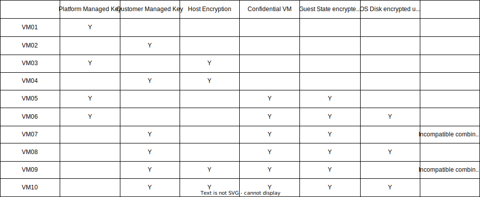

# Goal
To investigate the different disks encryption methods and how they work together. 

# Conclusions
- Disks are always encrypted at rest, even if you don't enable any encryption.
- You can choose the encryption mechanism for each disk individually.
- for each disk you can combine multiple disk encryption methods.
- If you want to use a Customer Managed Key, you need to use a Disk Encryption Set.
- Do not use Azure Disk Encryption, it's to restrictive. 
- You can use the Disk Encryption Set for more than 1 disk, in that case all disks are encrypted by the same key, recommend to use one Disk Encryption Set per VM, or even create separate Disk Encryption Sets for the OS disk and the data disks.


# Recommendation
## non confidential VM's
- Non confidential VMs are virtual machines where the data in use is not encrypted in the CPU cache or memory.  They may however require encryption at rest with a customer managed key
- Use the settings as demonstrated in VM02 for your VM 
- Use the settings as demonstrated in disk03 for disks that need encryption at rest.


## Confidential VM's
- Confidential VMs are virtual machines where the data in use is encrypted in the CPU cache or memory.  VM's that have such requirement usually require encryption at rest as well.
- Use the settings as demonstrated in VM10 for your VM 
- Use the settings as demonstrated in disk03 for disks that need encryption at rest.


## Disk Encryption Sets
- For each VM, use separate Disk Encryption Sets for the OS disk and the data disks. 
- Use a different key for each Disk Encryption Set


# Disk Encryption types
https://learn.microsoft.com/en-us/azure/virtual-machines/disk-encryption-overview

## Azure Disk Storage Server-Side Encryption
In the Azure portal this is sometimes abbreviated as "SSE"
https://learn.microsoft.com/en-us/azure/virtual-machines/disk-encryption
- Works with a disk encryption key set, Keys do not need to be in the same subscription.
- Keys do not need to be in the same tenant: https://learn.microsoft.com/en-us/azure/virtual-machines/disks-cross-tenant-customer-managed-keys?tabs=azure-portal.
- Not compatible with encryption at host.
- Temp disks are not encrypted, if you want to encrypt temp disks use encryption at host.
- More restrictions apply: https://learn.microsoft.com/en-us/azure/virtual-machines/disk-encryption#restrictions

## Encryption at Host
https://learn.microsoft.com/en-us/azure/virtual-machines/disk-encryption#encryption-at-host---end-to-end-encryption-for-your-vm-data
- You need to enable this on your subscription first: https://learn.microsoft.com/en-us/azure/virtual-machines/linux/disks-enable-host-based-encryption-cli 
- Temp disks & disk cache are encrypted as well
- Works with a disk encryption key set, Keys do not need to be in the same subscription.
- Not compatible with Azure Disk Storage Server-Side Encryption
- Not compatible with Azure Disk Encryption (guest-VM encryption using Bit locker / DM-Crypt)

In order to use encryption at host, you need to enable it on your subscription first (repeat for each subscription)

```az feature register --namespace Microsoft.Compute --name EncryptionAtHost```

## Azure Disk Encryption
In the Azure portal this is sometimes abbreviated as "ADE"
https://learn.microsoft.com/en-us/azure/virtual-machines/linux/disk-encryption-overview
https://learn.microsoft.com/en-us/azure/virtual-machines/windows/disk-encryption-overview
- Requires that the Key Vault where the CMK is stored is in the same region and subscription as the VM.
- Cannot (always) work on custom Linux Images.
- Cannot be combined with Disk Encryption Sets.  

In general, this is to restrictive and therefore not used in our scenarios.

## Confidential disk encryption (For the OS disk only)
- Works with a disk encryption key set, Keys do not need to be in the same subscription.
- Only works with confidential VM's (DCasv5 and ECasv5)
- The OS Disk is bound to the TPM chip of the VM, you cannot attach the OS disk to another VM.  This offer additional security, when someone is able to get (a copy of) the disk, he cannot use it or read any data of it.  This offers great additional security
- Azure Backup is limited in such way that it's currently not usable with CMK. https://learn.microsoft.com/en-us/azure/backup/backup-support-matrix-iaas#vm-compute-support.  Use database backup tools like RMAN for Oracle or T-SQL for MS SQL to backup the databases.
- Perhaps you can use a agent based backup solution, but this is not tested yet.


# Scenarios from the script


## VM01
Does not add any encryption on top of the encryption that is already there by default.  The key is provided by Microsoft.

## VM02
Does not add any encryption on top of the encryption that is already there by default, but the default encryption is with your own key.

```--os-disk-encryption-set $DESEncryptionAtRestWithCustomerKeyName```

Adds a disk encryption set to to the VM, this disk encryption set is used for the OS disk.  The disk encryption set uses your own key.

## VM03
Uses host based encryption, this encrypts the temp disk and the disk cache as well.

```--encryption-at-host true```
adds host based encryption to the VM. 

## VM04
Uses host based encryption, this encrypts the temp disk and the disk cache as well.  Your own key is used for the encryption.

## VM05
Similar to VM 1 but this is a confidential VM, and it uses confidential disk encryption for the os disk.  The encryption key is provided by Microsoft.

```--size "Standard_DC2as_v5"```
Selects a confidential VM Type

```--security-type "ConfidentialVM" ```
Configures the VM as a confidential VM

```--enable-vtpm true ```
Adds a virtual TPM chip to the VM, this is required for confidential vm's

```--enable-secure-boot true ```
Adds secure boot to the VM, this is required for confidential vm's.  Secure boot helps protect your VMs against boot kits, rootkits, and kernel-level malware.

```--os-disk-security-encryption-type "ConfidentialVM"```
Adds confidential disk encryption to the OS disk.  This binds the OS disk to the TPM chip of the VM, you cannot attach the OS disk to another VM.  This offer additional security, when someone is able to get (a copy of) the disk, they cannot use it or read any data of it.

```--os-disk-security-encryption-type "VMGuestStateOnly"```
On this confidential VM the guest state is encrypted using the TPM chip, but the disk is not.

## VM06
Similar to VM05 but here the the guest state and OS disk are encrypted using the TPM chip.
 
```--os-disk-security-encryption-type "DiskWithVMGuestState"```
On this confidential VM both the OS disk & the guest state are encrypted using the TPM chip.

## VM07
Similar to VM05 but using a Disk Encryption Set with your own key for the OS disk.

```--os-disk-secure-vm-disk-encryption-set $DESConfidentialVmEncryptedWithCustomerKeyName```
Notice that you use the flag --os-disk-secure-vm-disk-encryption-set for confidential compute VM's, this is different from the other VM's where you use --os-disk-encryption-set

## VM08
Similar to VM06 but using a Disk Encryption Set with your own key for the OS disk and the data disks.

```--os-disk-secure-vm-disk-encryption-set $DESConfidentialVmEncryptedWithCustomerKeyName```

## VM09
Similar to VM07 but now also adding host based encryption.

```--encryption-at-host true```

## VM10
Similar to VM08 but now also adding host based encryption.

```--encryption-at-host true```